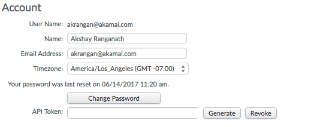
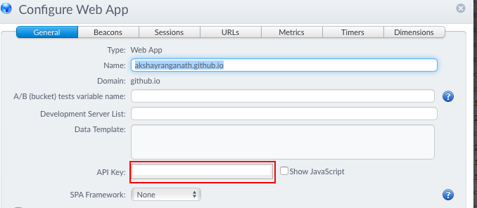

# mPulse Query API Wrapper

The python scripts are wrapper for [mPulse Query API](https://developer.akamai.com/api/web_performance/mpulse_query/v2.html). 

## Description
mPulse is the Real User Monitoring solution offered by Akamai. Along with the UI, the system exposes APIs to extract the reporting information. The purpose of this CLI is to make the use the API simple and easier to plug in to monitoring systems or even build systems like Jenkins.

To work with this CLI, you will need 2 pieces of information:

- API Token for the user: This is a unique value assigned to each registered user on mPulse system. You could think of this value as a combination of user/password for the mpulse API to authenticate. <br />To get this value, navigate to your user-profile and look for the field __API Token__.

			

- API key for the Application: The API key uniquely identifies a specific application. This value is required to let mPulse system know that you are looking for the performance information for a specific setup within the mPulse system.
	

### Working of the CLI
mPulse API requires a security token to authenticate the requests. This security token is based on the API token associated with each user. This CLI assumes that the user's API token is included in a plain-text _ini_ like file. By default, the CLI assumes this file to be `~/.mpulse`. The format of the file should be as follows:

[credential-section-name] 
apiToken=XXXXXXXX-XXXX-XXXX-XXXX-XXXXXXXXXXXX
tenant=Customer

Note that the `tenant` section could be optional. This is only necessary if you have access to more than one mPulse setup.

## Usage
To use the command, simply invoke the `akamai-mpulse` command with the right set of options. 

```
usage: akamai-mpulse [command] [--config CONFIG] [--section SECTION]
                               [--api API] [--timer TIMER]
                               ...

CLI for mPulse Query API. For more information about the API, please refer to
https://developer.akamai.com/api/web_performance/mpulse_query/v2.html

positional arguments:
  args

optional arguments:
  --config CONFIG    mPulse configuration file containing the user's API key
                     (deault=~/.mpulse)
  --section SECTION  Section within the config file containing the credentials
                     (default=[mpulse])
  --api API          API key of the app
  --timer TIMER      The timer to report (default=page load time)
```

The only _required_ parameter is the API key. 

By default, the function will use the following defaults:

- configuration file: `~/.mpulse`
- default section within this configuration file: `mpulse`
- under this configuration, it will look for 1 required and 1 optional parameter:
	- *apiToken*: This is the value pulled from the user's profile on the mPulse screen. This is a _required_ parameter.
	- *tenant*: Parameter used to restrict the security token to specific customer tenant.


## Optional Parameters
Apart from the parameters listed, any other parameter listed on the API page can be used. Here are a few examples:

- `timer`: (default _PageLoad_) This can be used to change the timer used for reported.
- `timezone`: (default _UTC_) Use this to change the _timezone_
- `type`: (default _summary_) This option switches the report. 

See the usage options below for details.

## Sample Usage

### Get the summary for last hour
By default, the command fetches the _PageLoad_ for the last 1 hour.
	akamai mpulse --api XXXXX-XXXXX-XXXXX-XXXXX-XXXXX

### Get summary for last day, week or month
By adding the `date-comparator` with one of the following value, you should get the default metric (_PageLoad_) for the duration. See the [date parameters](https://developer.akamai.com/api/web_performance/mpulse_query/v2.html#Parameters) for list of values.

Here's the command to get the data for last 12 hours.
	akamai mpulse --api XXXXX-XXXXX-XXXXX-XXXXX-XXXXX date-comparator=Last12Hours

### Get different timer
By default, we get the summary for _PageLoad_. You can use the `timer` to get other metrics as described in [timer parameters](https://developer.akamai.com/api/web_performance/mpulse_query/v2.html#TimerParameters). 

Here's the command to get the `DomLoad` metric.
	akamai mpulse --api XXXXX-XXXXX-XXXXX-XXXXX-XXXXX timer=DomLoad

### Drill down
You could drill down the data by using the [dimension paraeters](https://developer.akamai.com/api/web_performance/mpulse_query/v2.html#TimerParameters)	and group the result by using the [metrics by dimension](https://developer.akamai.com/api/web_performance/mpulse_query/v2.html#DimensionParameters) parameters.

To filter the summary data for just the US geography, you can use this:
	akamai mpulse --api XXXXX-XXXXX-XXXXX-XXXXX-XXXXX country=US

## Using JQ
I normally like to filter the output with [JQ](https://stedolan.github.io/jq/). This will allow for quicker parsing and extraction of specific fields. For example, if you just require the value for the median every hour, you could use this command:
	akamai mpulse --api XXXXX-XXXXX-XXXXX-XXXXX-XXXXX | jq '.median'

Hope this is useful and I'd love to hear feedback!


